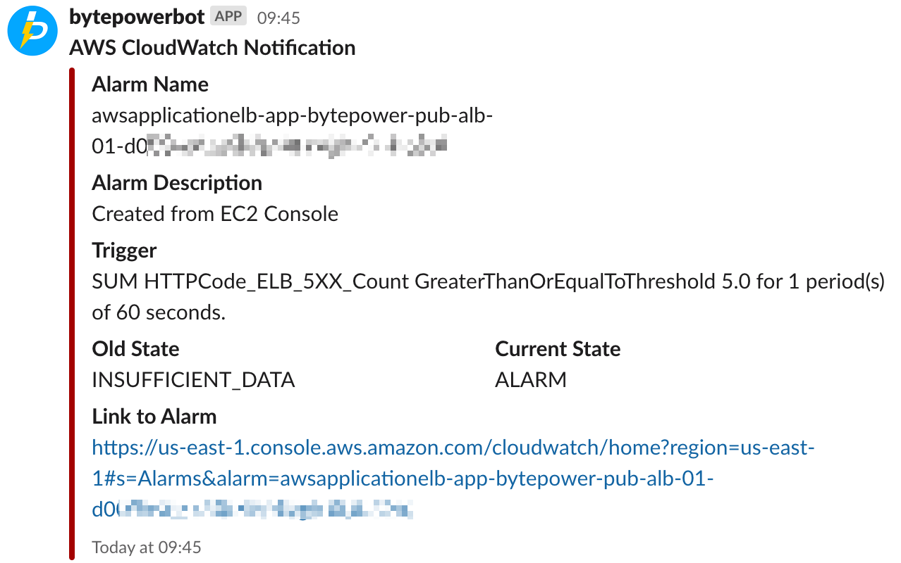

# lambda_cloudwatch_alarm_to_slack_python

An [AWS Lambda](http://aws.amazon.com/lambda/) function for better Slack notifications. 

This function was inspired by [assertible](https://github.com/assertible/lambda-cloudwatch-slack) and implemented with Python. 

It provides:

**Better default formatting for CloudWatch notifications**:

**Support for both AWS global and AWS China**

## How to use

### → AWS Configs

1. Create SNS Topic.
2. Setup AWS Cloudwatch Alarm on your required matrics and set SNS topic as the SNS Topic created in previous step.
3. Create Lambda function.
4. Copy and pated the function from here.
5. Change the Slack webhook URL and channel name with your own one.
6. Create subscriber on SNS topic as lambda function and select the lambda created in previous step.

### → Slack Configs

1. Create slack channel.
2. Go to slack workspace settings and setup incoming webhook.
3. Select the channel created in first step for incoming webhook.
